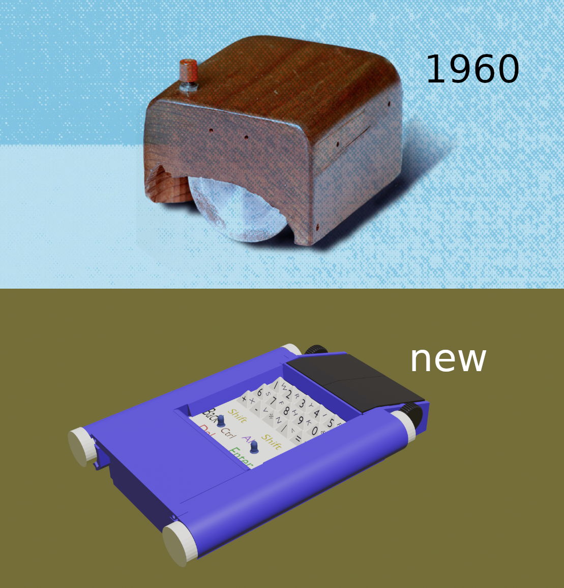

# Mouse Keyboard Pyramids (MKP)
## License   CC-BY-4.0 
A bit of history

In the root directory I placed  files and folders.
Individual files  in Python  come in two types. For some
reasons, I have not yet started placing them in different directories.
I decided to use a Raspberry Pi Pico microcontroller and code in
CircuitPython Adafruit. In addition, in the same root directory there
are text editor files in just Python. Since the mouse is also a
keyboard, the text editor should make it easier to learn typing methods
other than what you\'re used to. The folders contain FreeCad and KiCad
files. These are project schematic and PCB and so drawings of the device
itself. FreeCad files, in turn, are located in two folders. These are
part and assembly. There is also a datasheet folder, which also contains
a BOM file with all the listed names of parts, assemblies and
subassemblies. There are about a hundred or something parts, but there
are a little more than forty original models. Of these, about half are
molded plastic and the other half are various springs and fasteners.
Separately, you can highlight the parts of the moving mechanism. The
electromechanical circuit of a pyramid keyboard works as follows. The
upper part of the keyboard is the pyramids themselves or a matrix of
pyramids made of a material close to silicone rubber with symbols
printed on the edges.  My cardinal
difference from the usual standard keyboard is that touching is not text
input. Below the tip of the pyramid is a solid rod of conductive
material that runs vertically downwards. There it interacts with a
capacitive sensor on the motherboard. Thus, here we already get one of
the fifteen addresses of the position of the pyramid. But this is not
text yet. All this can still be seen on the screen of the text editor,
the place where you touched your finger. All we have to do is move
towards the desired symbol. You tilt the pyramid. The rod passes through
a perforated mesh on a spring suspension. The holes in the mesh are
slightly larger than the diameter of the rod. The tilting rod moves
freely in this gap for some time, but then it touches the edge of the
hole and begins to move the mesh itself. Since the other rods are
stationary at this time, but also have a similar gap, the mesh moves
until it rests on them. At the bottom, magnets are built into the mesh
in special sockets, and Hall sensors rise to them from the motherboard.
These are two sensors for two magnets that monitor the displacement of
the grid along the X Y axes. In this way, the tilt of the tip of the
pyramid in one of the four directions is monitored. To ensure sufficient
sensitivity, it is necessary that the stroke length be commensurate with
the length of the magnet itself. If a magnet 5 mm long is located one to
two millimeters from the Hall sensor, it provides sufficient sensitivity
at the analog input in the range from the lower barrier to 65000. I used
analog sensors of fairly low quality. I was unable to purchase Hall
sensors with PWM output. But if they show good results, I would
recommend them.
I decided to use the MPR121 as a capacitive touch sensor controller.
 This is a fairly budget
chip, and since I write code in CircuitPython, Adafruit has its own
library for the MPR121. It should be noted that the choice of
CircuitPython was due to the fact that it also has good HIDs, which is
very important when creating a hybrid mouse and keyboard. As I already
mentioned, I needed to get the addresses of 15 pyramids and two general
purpose joysticks here. For joysticks I have allocated separate pins.
For the keyboard I made a 5X3 matrix, five columns and three rows. Since
my matrix is much simpler than the Touchpad, I connected the
intersections through diodes. All this has been tested and works. You
can see this in more detail on the diagram in KiCad. In the
datasheet I indicated the PMW3360 optical mouse sensor, but this does
not mean that you must use it. The same goes for buttons and encoder. I
made a very small innovation, which, however, you may have already
noticed right away. I didn\'t have enough space under the mouse keys
themselves, so I made two wheels on the sides instead of one in the
middle. Perhaps some will find this even more convenient over time. In
any case, when the wheel is used instead of the third mouse button, you
do not need to tilt it to the side somehow, but simply press one of the
wheels. As power sources, I chose four Panasonic AA batteries, and
anything else that could replace them here. I hid them in the side
walls. Each side wall of the mouse with a hole or tunnel for two
batteries has its own PCB and all connectors with power supplies and the
motherboard. The fourth PCB on which the backlight LEDs are located is
located under the keyboard. It is also connected by connectors through
the side PCBs to the motherboard. Both side walls with batteries and PCB
are removable, representing separate modules. They are inserted into
slots and connectors and the whole thing is then secured with a rear top
cover with rods. No screws, everything is held on the bottom cover
latch. A single four screws hold the keyboard slide mechanism, the
motherboard, and the bottom of the mouse together. Thus, the device can
be completely assembled and disassembled up to half without having a
screwdriver at hand. The mouse will be wireless, although a budget
option with a wire is also possible, but I haven't made the final choice
here yet. For now, it is possible to use Raspberry Pi Pico with built-in
Wi-Fi. It would be great if someone offers their own option. 

Serge Sokolov sergesclv@gmail.com
 sergesclv3@protonmail.com
